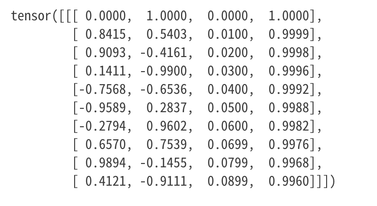
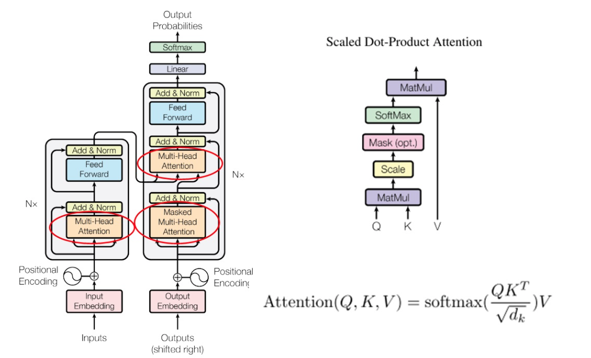
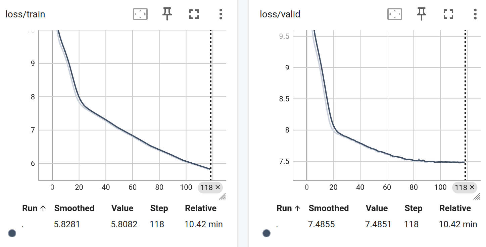

# 2025人工神经网络大作业
## 22336173 罗弘杰
## 源代码地址：
https://github.com/luohj29/2025_DL_Transformer.git
## 问题描述
2017的"attention is all you need"论文提出了transformer模型，极大地推动了自然语言处理领域的发展。该模型通过自注意力机制和位置编码等技术，解决了传统RNN和CNN在长序列处理中的局限性。
    本报告将介绍transformer模型的基本原理，并实现一个简化版本的ZH-EN机器翻译系统。
    
## 算法实现
### position encoding
$PE_{\text{pos},2i}   = \sin(\frac{\text{pos}}{10000^{2i/d_model}})$
$PE_{\text{pos},2i+1} = \cos(\frac{\text{pos}}{10000^{2i/d_model}})$
在transformer模型中，位置编码用于为输入序列中的每个单词提供位置信息，以便模型能够理解单词之间的顺序关系。
在实现中，是通过预定义的正弦和余弦函数来生成位置编码向量，这些向量与输入的词向量相加，从而为每个单词提供位置信息。
这是一个二维网格，自变量是pos和i,pos[0, max_len-1],i[0, d_model/2-1]
      
```python
pe = torch.zeros(max_len, d_model) #目标网格
position = torch.arange(0, max_len, dtype=torch.float32).unsqueeze(1)
# TODO: 计算位置编码
div_item = torch.exp(
    torch.arange(0, d_model, 2, dtype = torch.float32) * (-math.log(10000.0) / d_model)
)
pe[:, 0::2] = torch.sin(position * div_item)
pe[:, 1::2] = torch.cos(position * div_item)
pe = pe.unsqueeze(0)  # (1, max_len, D)， 增加一个b维度后面广播

# End of the TODO
# Register as buffer so it moves with .to(device) but isn't a parameter
self.register_buffer("pe", pe, persistent=False)
```
可视化pe,设置max_len=10,d_model=4

### self attention

然后是最关键的自注意力的部分，原文用了multi-head attention，其实叫多头注意力，在实现的时候更像是分多头注意力，就是将d_model分成多个部分进入不同的头，每个头执行自己的attention计算，最后将结果拼接起来。实现的时候由于矩阵乘法的特性，可以先将输入序列变换为Q,K,V三个大向量然后再分头进行自注意力计算。
```python
B, L_q, D = query.shape
Q = self.q_proj(query)  # (B, L_q, D)
K = self.k_proj(key)    # (B, L_k, D)
V = self.v_proj(value)

Q = Q.view(B, L_q, self.num_heads, self.head_dim)
K = K.view(B, -1, self.num_heads, self.head_dim)  # (B, L_k, H, head_dim)
V = V.view(B, -1, self.num_heads, self.head_dim)  # (B, L_v, H, head_dim)

Q = Q.transpose(1, 2)  # (B, H, L_q, head_dim)
K = K.transpose(1, 2)  # (B, H, L_k, head_dim)
V = V.transpose(1, 2)  # (B, H, L_v, head_dim)

scores = torch.matmul(Q, K.transpose(-2, -1))  # (B, H, L_q, L_k)
scores = scores / math.sqrt(self.head_dim)  # 缩放
if mask is not None:
    scores = scores.masked_fill(mask == 0, float("-inf"))
attn_weights = torch.softmax(scores, dim=-1)  # (B, H, L_q, L_k)
attn_output = torch.matmul(attn_weights, V)  # (B, H, L_q, head_dim)
attn_output = attn_output.transpose(1, 2)# (B, L_q, H, head_dim)
attn_output = attn_output.reshape(B, L_q, self.d_model)  # (B, L_q, D)
attn_output = self.dropout(attn_output)

attn_output = self.out_proj(attn_output)  # (B, L_q, D)
```
其中的mask部分，由于Decoder需要对输入序列取下三角矩阵，所以需要对mask进行处理，具体的实现是将mask的上三角部分置为0，下三角部分置为1。
### feed forward
前馈神经网络的出现是为了增强模型的表达能力，通常由两个线性变换和一个非线性激活函数组成。Transformer中的前馈网络通常使用ReLU或GELU作为激活函数。
```python
x = self.linear1(x)
x = self.activation(x)
x = self.dropout(x)
x = self.linear2(x)
x = self.dropout(x)
```
### layer combination
根据图纸将各个部分拼接起来，还需要考虑残差连接和layer_norm的部分，这是为了正则化和避免梯度消失的问题，按照原文的设置是dropout在layer_norm之前，layer_norm在残差连接之后。
```python
# encoder layer
# TODO (学生实现)：按顺序实现 (1) 自注意力 + 残差 + LN → (2) FFN + 残差 + LN
# ------------------------------------------------------------------
# (1) 自注意力
atten_out = self.self_attn(x, x, x, src_mask)  # (B, L_src, D)
atten_out = self.dropout(atten_out)
x = self.norm1(x + atten_out)  # 残差连接 + 层归一化 (B, L_src, D)
# (2) 前馈网络
ffn_out = self.ffn(x)
ffn_out = self.dropout(ffn_out)  # (B, L_src, D)
x = self.norm2(x + ffn_out)  # 残差连接 + 层归一化 (B, L_src, D)
return x  # 返回形状 (B, L_src, D)
```
 decoder部分更加复杂，考虑到teacher_forcing,cross_attention.
```python
atten_out = self.self_attn(x, x, x, tgt_mask)
atten_out = self.dropout(atten_out)
x = self.norm1(x + atten_out)  # 残差连接 + 层归一化 (B, L_tgt, D)
# (2) 编解码注意力
cross_out = self.cross_attn(x, memory, memory, src_mask)
atten_out = self.dropout(cross_out)  # (B, L_tgt, D)
x = self.norm2(x + cross_out)  # 残差连接 + 层归一化 (B, L_tgt, D)
# (3) 前馈网络
ffn_out = self.ffn(x)  #(B, L_tgt, D)
ffn_out = self.dropout(ffn_out)
x = self.norm3(x + ffn_out)  # 残差连接 + 层归一化 (B, L_tgt, D)
return x  # 返回形状 (B, L_tgt, D)
```
### encoder and decoder
 总的来说，encoder和decoder就是将输入处理一下，然后进入层层堆叠的encoder和decoder层，最后输出结果。encoder的输入是源语言的词向量，decoder的输入是目标语言的词向量，输出是目标语言的词向量。
 encoder需要考虑对词序列padding到统一长度以方便并行处理，以及对词向量映射到d_model，还有添加位置编码
```python
def forward(self, src: torch.Tensor, src_mask: torch.Tensor) -> torch.Tensor:
    x = self.embed(src) #from (B, L_src, vocab_size) to (B, L_src, D)
    x = self.pe(x) # add positional encoding
    for layer in self.layers:
        assert isinstance(x, torch.Tensor), "Layer output must be a Tensor, but got {}".format(type(x))
        x = layer(x, src_mask)
    return self.norm(x)
```

decoder因为teacher_forcing的原因，所以要将输入的语料进行处理，首先是将目标语言的词向量映射到d_model，然后添加位置编码，最后进入decoder层。
```python
def forward(
    self,
    tgt: torch.Tensor,
    memory: torch.Tensor,
    tgt_mask: torch.Tensor,
    src_mask: torch.Tensor,
) -> torch.Tensor:
    x = self.embed(tgt)
    x = self.pe(x)
    for layer in self.layers:
        x = layer(x, memory, tgt_mask, src_mask)
    return self.norm(x)
```

### transformer
最后是transformer的部分，它主要是将encoder输出的编码序列作为Memory输入到decoder中，在最后将decoder输出的部分经过线性映射到目标词表的tgt_vocab_sie,由于训练的时候,cross_entropy会自动对输出的Logits进行softmax，所以这里不需要再进行softmax处理。
这里有两种Mask,tgt_mask用于第一个decoder层的自注意力计算，是为了输出序列不要向后看，就像人类说话思考是想着前面说的话来决定下一句话，src_mask用于encoder的自注意力计算和decoder的cross attention计算，是为了将padding部分遮挡。
```python
def forward(self, src_ids: torch.Tensor, tgt_ids: torch.Tensor) -> torch.Tensor:
        src_mask = self._make_src_key_padding_mask(src_ids)
        tgt_mask = self._make_tgt_mask(tgt_ids)

        memory = self.encoder(src_ids, src_mask)
        dec_out = self.decoder(tgt_ids, memory, tgt_mask, src_mask)
        return self.proj(dec_out)
```
<!-- ## 数据处理
对于nlp任务，分词总是必须的，我们这里使用Jieba -->

## 实验：训练和测试
    在24GB显存的4090上测试100k数据，可以发现会有过拟合的情况出现
```yaml
# ------------- 模型结构 ----------------
model:
  enc_layers: 4          # Transformer Encoder 层数
  dec_layers: 4          # Transformer Decoder 层数
  emb_size: 256          # 词向量 / 隐层维度
  nhead: 8               # Multi-Head Attention 头数
  ffn_dim: 1024          # Feed-Forward 隐层
  dropout: 0.2          # Dropout 概率
```
BLEU score: 0.40

